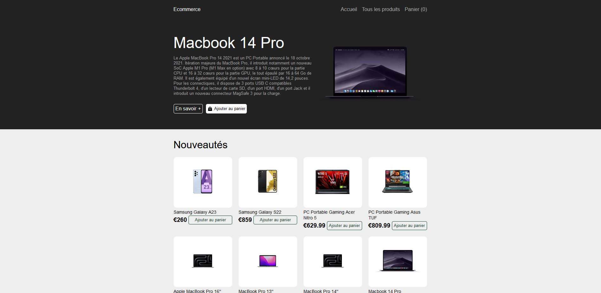
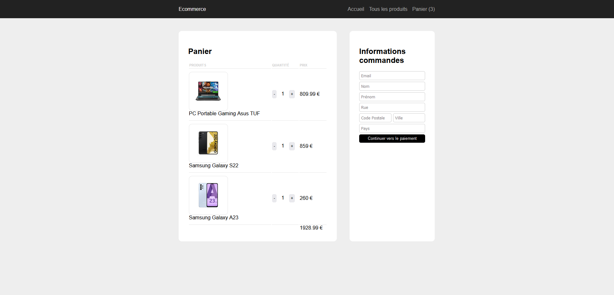
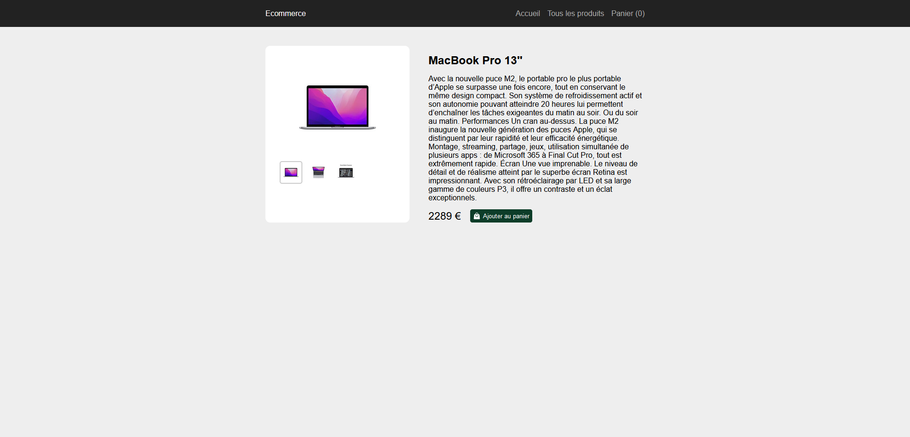
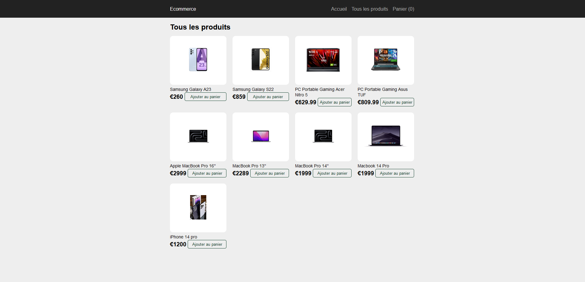

# 🛍️ E-Commerce Vitrine 🛒

## Description

Bienvenue sur ce projet, il s'agit d'un site vitrine dédié au commerce en ligne. Ce projet a été créé dans le but d'explorer le domaine du commerce électronique et de mettre en avant des produits. Même s'il peut sembler simple à première vue, il m'a offert une opportunité d'expérimenter diverses technologies. 

**Liens vers le panneau d'Administration :** [E-Commerce Administration](https://ecommerce-vitrine.vercel.app/)  
Prévoir quelques ralentissement dû à la gratuité des services d'hébergement utilisés.

## Fonctionnalités

- Mise en avant d'un produit sur la page d'accueil.
- Page de description détaillée d'un produit.
- Liste variée de produits.
- Fonctionnalité de panier.
- Achat grâce à l'API de Stripe.

## Technologies Utilisées

- ReactJS ⚛️
- NextJS 🚀
- Styled Components 💅
- Stripe 💳
- Mongoose 🍃

## Aperçu

Homepage :

Panier :

Un produit :

Tous les produits :

## Essai d'Achat

N'hésitez pas à essayer l'expérience d'achat avec la Carte Bancaire de test :
 💸 `4242 4242 4242 4242` 💸